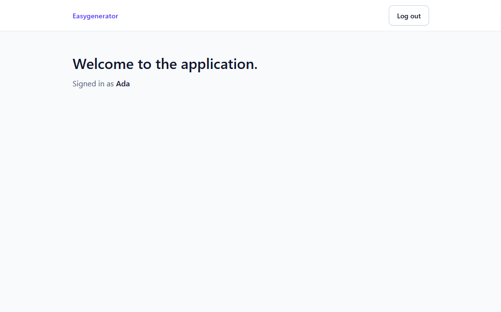

# Easygenerator Auth

A NestJS and MongoDB API with a React frontend for sign-up, sign-in, a protected page and logout. It uses revocable cookie sessions and includes validation on both sides, structured logging, one error shape, rate limiting, tests, API documentation, CI on every push and a workflow that publishes a container image to GHCR.



There is no hosted demo. Run the whole thing locally on one port with:

```bash
docker compose --profile full up --build
```

and open <http://localhost:3000>. Swagger UI is served at `/api/docs` whenever `NODE_ENV` is not `production`, so in development it is at <http://localhost:3000/api/docs>. The full profile runs in production mode and does not serve it.

## Stack

| Layer | Choice |
|---|---|
| Runtime | Node 24, npm 11 |
| Backend | NestJS 11 (Express), Mongoose 9, MongoDB 8, argon2, class-validator, nestjs-pino, Helmet, @nestjs/throttler, @nestjs/swagger, @nestjs/terminus, Joi |
| Frontend | React 19, Vite 8, TypeScript (strict), React Router 8, React Hook Form + Zod, Tailwind CSS 4 |
| Tests | Jest + supertest + mongodb-memory-server (backend), Vitest + Testing Library (frontend) |
| Delivery | Multi-stage Dockerfile, Docker Compose, GitHub Actions, GHCR |

## Quick start

Prerequisites: the production image needs Docker only. Development needs Node 24, npm 11 and Docker (for MongoDB). Run every command from the repository root; the backend and frontend dev servers each need their own terminal.

### Development (Vite dev server + API + local Mongo)

```bash
docker compose up -d
```

```bash
cd backend && cp .env.example .env && npm ci && npm run start:dev
```

```bash
cd frontend && npm ci && npm run dev
```

Open <http://localhost:5173>. Vite proxies `/api` to the API on port 3000, so the browser only ever talks to one origin and no CORS is involved. Swagger UI: <http://localhost:3000/api/docs>.

### Production image (API serving the built SPA on one port)

```bash
docker compose --profile full up --build
```

Open <http://localhost:3000>. The container runs with `NODE_ENV=production`, so the session cookie is `__Host-session; Secure`. Chrome and Firefox accept Secure cookies on `http://localhost`; Safari does not, so use one of those two for the local full profile.

## Scripts

Backend (`backend/`):

| Script | What it does |
|---|---|
| `npm run start:dev` | API with watch mode on port 3000 |
| `npm run build` / `npm run start:prod` | Compile to `dist/` and run it |
| `npm run lint` / `npm run typecheck` | ESLint (type-aware) / `tsc --noEmit` |
| `npm test` | Unit tests |
| `npm run test:e2e` | End-to-end tests against a real in-memory MongoDB 8.0.32 (downloaded once) |
| `npm run format` | Prettier |

Frontend (`frontend/`):

| Script | What it does |
|---|---|
| `npm run dev` | Vite dev server on port 5173 with the `/api` proxy |
| `npm run build` / `npm run preview` | Production build to `dist/` / serve it locally |
| `npm run lint` / `npm run typecheck` | ESLint / `tsc -b` |
| `npm test` | Vitest component and schema tests |
| `npm run format` | Prettier |

## Configuration

The API validates its environment with Joi at boot and refuses to start on a bad value. See [`backend/.env.example`](backend/.env.example).

| Variable | Default | Notes |
|---|---|---|
| `NODE_ENV` | `development` | `production` switches to the `__Host-session` Secure cookie, serves `frontend/dist` and disables Swagger |
| `PORT` | `3000` | |
| `MONGODB_URI` | required | `mongodb://` or `mongodb+srv://` |
| `SESSION_TTL_SECONDS` | `28800` | Fixed 8-hour session lifetime, no sliding renewal |
| `ALLOWED_ORIGINS` | dev: `http://localhost:5173,http://localhost:3000` | **Required in production.** Comma-separated `scheme://host[:port]` values; a mutation with an `Origin` header not listed gets 403 |
| `TRUST_PROXY_HOPS` | `0` | Number of reverse proxies in front of the API. Never `true`; set it to the real hop count or every client shares one rate-limit bucket |
| `THROTTLE_GLOBAL_LIMIT` | `100` | Requests per minute per IP, separately for each API handler |
| `THROTTLE_AUTH_LIMIT` | `10` | Requests per minute per IP on signup and on signin (each) |
| `GIT_SHA` | `dev` | Baked into the image; reported by `GET /api/health/live` |

No auth signing key is needed: session tokens are random, not signed. Production database credentials are supplied through `MONGODB_URI` and kept out of Git.

## CI/CD

[`.github/workflows/ci.yml`](.github/workflows/ci.yml) runs on every push and pull request with `permissions: contents: read` and no secrets:

- **backend**: `npm ci`, lint, typecheck, unit tests, e2e tests (real `mongod` 8.0.32, binary cached), build.
- **frontend**: `npm ci`, lint, typecheck, tests, build.
- **image** (branches and PRs): builds the production image without pushing, so the Dockerfile is verified everywhere.
- **publish** (pushes to `main` only, after backend and frontend pass): builds the image with `GIT_SHA` baked in and pushes it to GHCR as `ghcr.io/<owner>/<repo>:<commit-sha>`, authenticated with the workflow's own `GITHUB_TOKEN` (`packages: write`). The published image is exactly the tested commit and reports it at `/api/health/live`. It is deployable to any container host; no live deployment is part of this repo.

## API

All API routes are under `/api`. Every mutation must send `Content-Type: application/json` (logout sends `{}`). Responses under `/api/auth` and `/api/users` carry `Cache-Control: no-store`, including early failures. Full schemas are in Swagger.

Shared request errors: malformed JSON → 400, body over 10 kb → 413, non-JSON mutation → 415, mutation with a disallowed `Origin` → 403, and an exceeded per-IP handler limit → 429. Unexpected failures return a generic 500. The table lists endpoint-specific errors; signup and signin can also return 400 for invalid fields.

| Method & path | Auth | Success | Errors |
|---|---|---|---|
| `POST /api/auth/signup` | public | `201 { user, authenticated: true }` + cookie. If the account was created but its session could not be saved: `201 { user, authenticated: false }`, no new cookie | 400, 409 `EMAIL_TAKEN`, 503 |
| `POST /api/auth/signin` | public | `200 { user }` + new cookie; the session the request carried is retired on a best-effort basis (a failed delete is logged and that session expires on its own) | 400, 401 `INVALID_CREDENTIALS`, 503 |
| `POST /api/auth/logout` | public, idempotent | `204`, server session deleted, cookie cleared | 503 (cookie kept, so the client never pretends it logged out) |
| `GET /api/users/me` | session cookie | `200 { user }` | 401 `UNAUTHENTICATED`, 503 |
| `GET /api/health/live` | public | `200 { status: "ok", version: GIT_SHA }` | |
| `GET /api/health/ready` | public | `200` when MongoDB answers a ping | 503 |

`user` is always `{ id, email, name, createdAt }`, built by a mapper, never a raw document.

Every error, including body-parser failures, has one shape:

```json
{
  "statusCode": 400,
  "code": "VALIDATION_ERROR",
  "message": "Check the highlighted fields.",
  "details": [{ "field": "password", "messages": ["..."] }],
  "requestId": "0b6c1f7e-..."
}
```

`details` appears only for DTO validation errors. On protected routes, 401 means exactly "no valid session"; sign-in returns 401 for invalid credentials. A database outage is a 503, never a 401, so the UI shows a retry screen instead of a sign-in page.

## Key decisions

The full write-up with alternatives is in [`docs/design.md`](docs/design.md). The short version:

- **Revocable server sessions.** I included the brief's optional logout and required it to revoke the session. The cookie holds 32 random bytes and the database holds only their SHA-256 hash. A JWT would still need a database check to meet that requirement. A leaked `sessions` collection yields no usable cookies. Fixed 8-hour lifetime, no sliding renewal.
- **Deny by default.** A global guard protects Nest API handlers; they opt out with `@Public()`, so a new handler cannot ship unprotected by accident.
- **CSRF without a token protocol.** Every mutation must be `application/json` (415 otherwise), the cookie is `SameSite=Lax`, and a mutation naming a foreign `Origin` is rejected (403). A cross-site page cannot send JSON without a CORS preflight, and this API grants none. CORS is simply not enabled: dev uses the Vite proxy and production serves the SPA from the same origin.
- **Cookie flags derived from `NODE_ENV`, not a toggle.** Production always gets `__Host-session; Secure; HttpOnly; SameSite=Lax; Path=/` with no `Domain`, which also blocks subdomain cookie injection.
- **argon2id** with the OWASP baseline (19 MiB, t=2, p=1). Passwords are never trimmed or case-changed. Sign-in verifies against a precomputed dummy hash for unknown emails to narrow the timing gap.
- **Same validation rules on both sides.** Name and password lengths count Unicode code points. Email uses one ASCII pattern; internationalized addresses are not supported. Both apps run identical validation vectors in their test suites.
- **Uniqueness by index, not pre-check.** Five concurrent signups with the same email yield exactly one 201; only an E11000 on the email index maps to 409.
- **Honest partial failure.** Signup is two writes without a transaction. If the session insert fails, the response says `authenticated: false` and the UI sends the user to sign in, instead of pretending the signup failed.
- **Four auth states in the SPA** (`checking`, `authenticated`, `unauthenticated`, `unavailable`) so there is no redirect flash and an outage is never shown as "signed out". A generation counter discards stale `/me` responses that finish after a sign-in or logout.
- **One `createApp()`** used by `main.ts` and every e2e test, with HTTP policy checked in both normal and production configurations.

## Security notes

- Helmet defaults (CSP, HSTS, nosniff, no `X-Powered-By`). JSON bodies capped at 10 kb (413).
- Logs are JSON with a server-generated request id (echoed as `X-Request-Id`). `Cookie`, `Authorization` and `Set-Cookie` are redacted, bodies are never logged, and unexpected errors are logged through an allowlist (class name, driver code, stack frames) because raw messages can contain data, for example Mongo's duplicate-key message includes the email.
- DTOs reject unknown fields, wrong types and operator objects such as `{"$gt": ""}`.
- `passwordHash` is `select: false` and the response mapper is an allowlist.
- Unknown `/api/*` paths return a JSON 404 in production too; they never fall back to `index.html`.
- Rate limits are in-memory per IP and API handler: 100/min by default, plus 10/min on signup and on signin separately. 429 responses carry `Retry-After`.
- The 409 on signup reveals that an email is registered. Accepted for clarity; the fix is a verification flow that gives the same public response whether or not the address is registered (see below).
- Swagger is served only outside production.

## Production next steps

Deliberately not built, with the trigger and the approach:

| Not built | When / how |
|---|---|
| Shared rate limits | Multiple instances → Redis-backed throttler storage |
| Revised CSRF policy | A cross-origin frontend or non-JSON forms appear → revisit CORS, cookie settings and whether a synchronizer or double-submit token is needed |
| "Log out everywhere" | `deleteMany({ userId })`; the index already exists |
| Sliding sessions / remember-me | Idle timeout plus an absolute cap, rotate the token on renewal |
| Email verification, password reset | Token flows; email sent through a queue (RabbitMQ) |
| Signup reveals existing emails (409) | Verification flow that responds identically either way |
| Argon2 under heavy load | Configured memory cost is 19 MiB per hash → measure concurrency and total memory use, then cap concurrent hashes and size the container |
| Index migrations | `autoIndex` off, versioned migration step in CD |
| Backups / restore drills | Managed database backups plus a periodic restore test |
| Cross-tab sync | BroadcastChannel to refresh auth state in other tabs |
| Live deployment | The published image runs on any container host with a `MONGODB_URI` and `ALLOWED_ORIGINS` |
| Service extraction | Only when a separate team or release cadence justifies it; publish `user.created` events |

## How AI was used

See [`AI.md`](AI.md).
